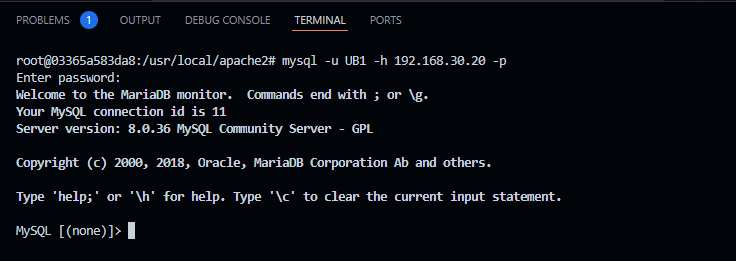

# Bloodbank Docker

Run: `docker compose up -d`

1. Database is fully configured and has remote access (mount mysql-data folder).

    `apt install mariadb-client`

    password: `p1ZT3Z8TmeJCgsAG1HyNnwt65rbgzs9sWuYs7fcndH3eSGbP4X`

    

2. The site is not working, it needs to be fixed.
